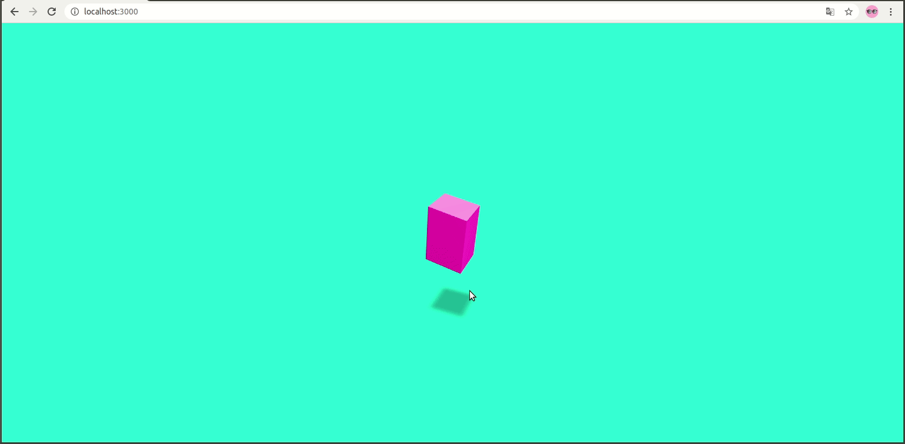

# Three.js 学习(1): react-three-fiber入门

要说Three.js要先提一下WebGl:

+ WebGl是openGl的前端实现，Three.js是WebGl的进一步封装，react-three-fiber是Three.js进一步封装用于react.js前端架构。

+ WebGL可以为HTML5 Canvas提供硬件3D加速渲染，这样Web开发人员就可以借助系统显卡来在浏览器里更流畅地展示3D场景和模型了，还能创建复杂的导航和数据视觉化。

## 1. react-three-fiber

只用reactjs时更方便的使用threejs，有一些封装好的组建直接就可以用。

[项目地址](https://github.com/react-spring/react-three-fiber)

### 1.1 threejs的基本构造

+ 网格模型就是我们看到的东西
+ 光源就是打光位置以及强度方向等
+ 相机就是观察情况
+ 显然器就是设置的渲染图形模式


## 2. 简单实践

简单的写了一个小栗子，实现如下功能：

+ 一个立方体模型，一个平面模型，平面模型用于投放阴影
+ 点击变形
+ 点击变颜色
+ 旋转观察
+ 阴影显示

### 2.1 效果



### 2.2 内容

+ 创建Canvas

```javascript
<Canvas
    colorManagement  // 适用于所有颜色和纹理的自动sRGB编码
    shadowMap  // gl.shadowMap
    camera={{position: [0, 2, 10], fov: 70}}
>
```

+ 光源情况

```javascript
{/*pointLight 光源*/}
<pointLight position={[10, 10, 10]}/>
{/*环境光源 调节点光源*/}
<ambientLight intensity={0.1}/>
{/*平行光， 设置阴影*/}
<directionalLight
    castShadow
    position={[0, 10, 0]}
    intensity={1.5}
    shadow-mapSize-width={1024}
    shadow-mapSize-height={1024}
    shadow-camera-far={50}
    shadow-camera-left={-10}
    shadow-camera-right={10}
    shadow-camera-top={10}
    shadow-camera-bottom={-10}
/>
```

+ 平面几何图形

```java
<a.mesh
    rotation={[-Math.PI / 2, 0, 0]}
    position={[0, -3, 0]}
    receiveShadow // 接收阴影
>
    {/*添加平面几何，用于投射阴影*/}
    <planeBufferGeometry attach='geometry' args={[100, 100]} />
    <shadowMaterial attach='material' opacity={0.3} />
</a.mesh>
```

+ 立方体几何图形

```java
<a.mesh
    ref={meshRef}
    onClick={() => setExpand(!expand)}
    rotation={[Math.PI / 2, 0, 0]}
    scale={props.scale}
    castShadow  // 产生阴影
>
    {/*xxxBufferGeometry 几何体对象*/}
    <boxBufferGeometry attach="geometry"/>
    {/*Material 材质设定*/}
    <MeshWobbleMaterial
        color={expand?'hotpink':'orange'}
        speed={3}
        factor={0.3}
    />
</a.mesh>
```

+ 旋转

```javascript
{/*用于旋转观察*/}
<OrbitControls />
```


## 3.源码

github